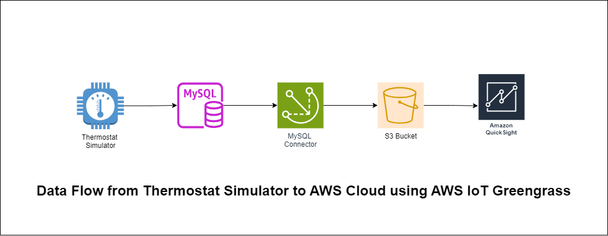

# AWS IoT Greengrass Custom Component for MySQL🛠️

A custom AWS Greengrass component to periodically fetch data from a MySQL database and publish it to an Amazon S3 bucket.

## 🏗️Architecture

 

## Components

#### MySQL Database:

- Functions as the pivotal data source housing pertinent information.
- Data is periodically fetched from this repository.

#### AWS Greengrass Component:

- Developed utilizing Python, this bespoke AWS Greengrass component orchestrates the seamless connectivity and data retrieval from the MySQL database.
- Leveraging industry-standard libraries, it establishes a secure connection to the MySQL database.
- Upon connectivity establishment, the component meticulously executes data retrieval operations, adhering to pre-defined schedules.
- The retrieved dataset undergoes meticulous transformation into a suitable format for subsequent storage on Amazon S3.

#### Amazon S3 Bucket:

- Serves as the quintessential endpoint for storing the extracted data.
- Data publication to the designated S3 bucket ensures unparalleled durability and scalability.

## 🔧Prerequisites

Before starting the implementation, ensure the following prerequisites are met:

1. **AWS Account**: You should have access to an AWS account to utilize AWS services such as AWS Greengrass and Amazon S3.

2. **AWS Greengrass Core**: Set up an AWS Greengrass Core on your edge device following the official documentation.

3. **MySQL Database**: Install and configure MySQL database server. Ensure you have appropriate permissions to create and manage databases and tables.

4. **Python Environment**: Ensure Python is installed on your system. The Python version should be compatible with the AWS Greengrass Core and SDKs.

## 🛠️ Implementation Steps

1. **Database Setup**:
   - Provision a MySQL database instance following industry best practices.
   - Establish a database schema conducive to the storage of pertinent data.

2. **Python Thermostat Simulator**:
   - Create a Python script to simulate thermostat data.
   - The script connects to the MySQL database, inserts one record into the table, sleeps for 1 second, inserts a new record with random data, and loops indefinitely.

3. **AWS Greengrass Component Development**:
   - Develop a custom AWS Greengrass component utilizing Python and AWS SDKs.
   - Implement robust database connectivity logic, ensuring secure and efficient data retrieval.
   - Configure the component to execute periodic data retrieval operations, maintaining synchronization with the database.
   - Employ appropriate data transformation techniques to facilitate seamless compatibility with Amazon S3.

4. **Amazon S3 Configuration**:
   - Create an Amazon S3 bucket tailored to accommodate the extracted dataset.
   - Establish appropriate access controls and permissions to ensure data integrity and confidentiality.

5. **Deployment and Monitoring**:
   - Deploy the finalized Greengrass component to edge devices leveraging AWS Greengrass Core.
   - Implement comprehensive monitoring and logging mechanisms to track component execution and ensure operational reliability.

## Copyright

© [Sravanthi Thukivakam [2024]

## 📚References

- [AWS Greengrass Documentation](https://docs.aws.amazon.com/greengrass/latest/developerguide/what-is-gg.html)
- [MySQL Documentation](https://dev.mysql.com/doc/)
- [Python Documentation](https://docs.python.org/)
- [Linux Commands](Linux.md)
- [MySQL Installation](MySQL.md)
- [Greengrass Installation](Greengrass.md)

Excited to see how this project enables seamless data synchronization at the edge! Let me know your thoughts and feel free to contribute on GitHub. 🌐💡
